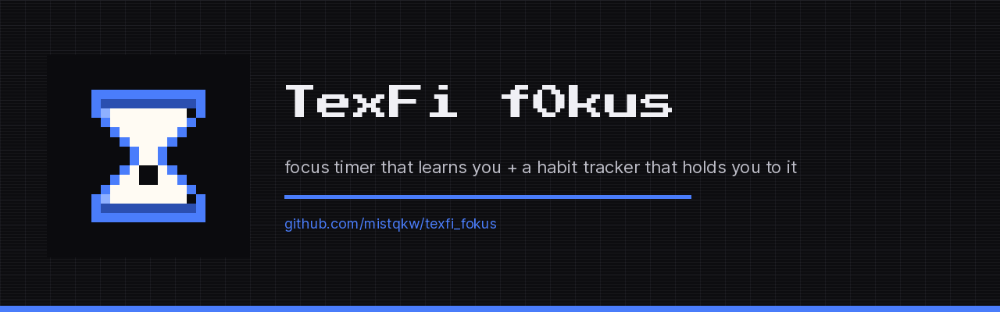

<p align="center">
  
</p>

<h1 align="center">TexFi f0kus</h1>

<p align="center">
  <b>A focus timer that learns how you actually work — and a habit tracker that holds you to your word.</b><br>
  Check in with your mood, get a session length that fits it, and let the app get sharper with every session.
</p>

<p align="center">
  
  
  
  
</p>

<p align="center">
  <a href="#features">Features</a> ·
  <a href="#design">Design</a> ·
  <a href="#stack">Stack</a> ·
  <a href="#project-structure">Project structure</a>
</p>

---

## Features

- 🎛 **Mood check-in** — a four-state switch (bad · normal · good · full f0kus) with a different vibration pattern for each: one weak pulse at the bottom, a rising burst at the top. The state is something you feel, not just read
- 🧠 **Recommendations that learn** — a contextual bandit picks between Sprint 15, Pomodoro 25/5, Pomodoro 50/10, Deep work 90 **and any preset you write yourself** based on what has actually worked *for you* in this mood, on this kind of task, at this hour. Not a lookup table someone guessed on your behalf
- ⏳ **Your own rhythm, not just the built-in four** — if you work in 35/7 or 20/3, add it in Settings and it becomes a real option the engine can propose, with its own accumulated statistics rather than a shortcut that borrows another technique's record
- 🔍 **Recommendations that show their work** — the "why this" card names the level of context the advice rests on (this exact situation · similar work · this mood in general), how many of your own sessions are behind it and how often it worked out — not a bare confidence percentage
- 📝 **What the session was actually like** — an optional reason when you stop early (distracted · wrong task · too tired · rather not say) and a short note or pixel sticker afterwards. Choosing a technique against the recommendation is recorded separately and taught at a third of the weight: it says you disagreed with the advice, not that the technique is bad
- 🛑 **Brakes against burnout** — a nudge when a new session starts within minutes of the last, a night soft cap that stops suggesting anything longer than 25/5 past your chosen hour, and a pause after a run of interrupted sessions — two to five, your call. Every one of them can be overruled on the spot
- 🌱 **Honest cold start** — for the first ten sessions the app says so plainly and falls back to sensible defaults, instead of dressing up noise as insight
- ⏱ **A dial you can turn mid-session** — drag the ring to add or shave minutes without leaving the timer; it clicks once per minute under your thumb. Full-screen minimal mode on a double tap
- ✅ **Habits with a price** — every habit requires you to write down what you owe yourself if you skip it. The app stores it, shows it on the card, and reads it back in the reminder. Nothing is automated — that is the point
- 🎁 **A reward next to the price** — an optional "if you keep it up for N days" you write yourself, shown the moment the streak reaches it
- 📅 **Habits that don't need fixed days** — either chosen weekdays or simply N times a week, where the streak counts closed weeks instead of days
- ❄️ **One way out** — a streak freeze, once a week by default: a skipped day that holds the streak without extending it, with the remaining quota visible on the card
- 🔥 **Streaks that don't lie** — an unfinished day doesn't break the streak until the day is actually over
- 🗒 **Plan for the day** — two or three tasks in rough order, offered first at the next check-in, each with an optional checklist of up to five steps you tick off while the timer runs
- 🔁 **One more like this** — restart a finished session with the same settings, without going through the check-in again
- ✨ **A character that visibly grows** — eight rank titles from *a spark* to *a small sun*, and six drawn stages the spark passes through on the way. The whole ladder is on screen from level one, dimmed but visible: what you will look like at level 21 is not a surprise to be unlocked, it is the reason to come back
- 🖼 **A photo of what you actually worked on** — optionally attach a shot of the notebook, the screen, the desk to a session. It is stored on the device, shown as a small preview beside the task in history, opens full-size on a tap, and is deleted from disk together with the session. Skip it and nothing about the app changes
- 📊 **Statistics** — a pixel-art contribution heatmap, focus minutes per day, a breakdown by task category, habit completion rates, how often each penalty actually bit, why sessions broke off, a plain list of the sessions themselves, and the most useful chart of all: which mood you actually finish sessions in. Weeks start on Monday or Sunday, whichever is yours
- 🔔 **Local reminders** — per-habit reminders plus an end-of-day summary: what's still open, and on a productive day the sessions, focus time and dominant mood behind it
- 💾 **Export and import JSON** — everything you've logged, in one file, and back again on a new device — merging with what's there or replacing it, after a warning that says plainly which one wipes your history. An optional weekly backup writes the same file to a `backups/` folder on its own and keeps the last four, so an offline app with no cloud behind it still has something to fall back on
- 🌍 **Languages** — English, Русский, Polski, Українська, following the system by default
- 🎨 **Two themes, five accents** — pixel-art in the dark (black, grey, `#4a7dfb`) and a warm orange-and-beige light theme, with a preset accent tone you can swap without the palette losing its footing
- 🎮 **An optional game on top** — offered as a plain choice on first run and switchable in Settings ever after. In game mode the same sessions become a fight: nine drifters, three to a world, each with its own name, silhouette and one-line description, stand on a map of three named worlds with a boss at the end of each. A session against one opens a **battle screen** where the creature fills the screen and its HP bar drains in step with your focus time, so the damage is something you watch happen rather than read about afterwards. Bosses only take real damage from sessions started in **full f0kus**, and the screen says up front what running out of stamina costs — the boss heals to full — instead of quietly rolling your progress back. Stop early and the drifter simply held its ground: no scolding, and the XP you earned is still yours. Turning game mode off hides all of it and keeps every point of it
- 🔕 **A timer end you can't miss** — the completion notification is handed to the system when the session starts, not fired by a live timer, so it survives the app being closed or the screen locked; it waits in the tray instead of auto-dismissing, and the vibration goes straight to the motor so silent mode can't swallow it. The countdown itself is read off the wall clock, so locking the phone mid-session and coming back shows the real remaining time, not the time the screen went dark
- 🔔 **A completion sound that plays on silent — and with the screen off** — pick one of five bundled chiptune cues in Settings and preview it with a tap. The sound belongs to the notification channel itself, not to a player inside the app: the cues ship as Android raw resources and the scheduled notification names the chosen one, so the system plays it whether the app is in front of you, backgrounded or killed outright. The channel runs on the alarm stream (Android `USAGE_ALARM`), which the mute switch doesn't silence
- 🌒 **Quiet mode on the timer** — the screen stays awake while a session or a fight is on, and a tap on the moon turns the timer into its plainest possible form: black background, grey digits, no sprite, no HP bar, no accent colour, and the screen dimmed down. Tap anywhere to come back — brightness is restored on every way out. It is not an Always-On Display and doesn't pretend to be one: it lives inside the app, on a screen that is on
- ⬆️ **It tells you when there's a newer build** — the app is handed out as an `.apk` through GitHub Releases, so it asks the Releases API itself instead of leaving you to check. A new version shows up in Settings with the first few lines of its release notes and a button that downloads the package and hands it to the system installer. Checks are cached for hours (failures too, so a phone with no signal doesn't hammer the API), and every failure is silent — the card simply doesn't appear. Android only, since nowhere else can install an `.apk`
- 📴 **Fully offline** — no account, no cloud, no telemetry. Nothing you log ever leaves the device; the only network call the app can make is the update check above, and it asks GitHub about releases without sending anything about you

Part of the **TexFi** ecosystem, alongside [TexFi m0ney](https://github.com/mistqkw/texfi-money), [TexFi Files](https://github.com/mistqkw/texfi_files) and [TeFBlock](https://github.com/mistqkw/tefblock).

## Design

Pixel-art, deliberately — retro-game furniture rather than the flat black minimalism every
second app defaults to. Accent elements (headings, timer digits, counters) are set in
**Press Start 2P**; everything you actually read for meaning is **Inter**, because a pixel
font in a paragraph is a design statement at the reader's expense. Numbers use tabular
figures so the timer doesn't twitch on every tick.

The dark theme is black and grey with the TexFi blue `#4a7dfb`; the light theme is warm
orange, cream and beige — the same pixel language, sunlit. Both palettes are declared as
tokens in [`app_palettes.dart`](lib/core/theme/app_palettes.dart) and reach widgets through
a `ThemeExtension` (`context.colors`), never as literal colors in a screen.

Cards carry moderate radii (8–12px) so the interface still reads as modern; buttons,
switches, checkboxes and heatmap cells stay square, with a 2px border and a solid offset
shadow instead of a blur — a key that visibly depresses when you press it. That shadow is
one widget ([`pixel_shadow.dart`](lib/presentation/shared/pixel_shadow.dart)), reused by
cards, buttons and the range switches alike, so the sense of depth cannot drift a pixel
between screens. Every distance comes from one 4pt scale in
[`app_spacing.dart`](lib/core/theme/app_spacing.dart) rather than being eyeballed per
screen.

Every icon in the app is a sprite drawn from a text grid — `'.'` for empty, `'x'` for a
filled pixel — rendered by [`pixel_sprite.dart`](lib/presentation/shared/pixel_sprite.dart)
and catalogued in `PixelSprites`. The bottom tab bar, the mood faces, the onboarding
illustrations and the button glyphs all come from that one grid, so nothing has to be
imported from a Material icon set that belongs to a different design language. Radio
buttons, checkboxes and switches are square-framed pixel indicators
([`pixel_radio.dart`](lib/presentation/shared/pixel_radio.dart)) rather than Material's
circles, down to a square slider thumb.

Screen transitions use a short pixel-dissolve with a scanline pass
([`app_page_transitions.dart`](lib/core/theme/app_page_transitions.dart)) — ~260ms, present
enough to notice once, quiet enough to stop noticing. The background carries a faint
deterministic pixel speckle so the dark theme reads as a surface rather than a void.

## Stack

- **Flutter** — one codebase across Android, Windows, Linux and macOS, and the only toolkit where a hand-painted pixel dial behaves identically on all four
- **Riverpod** — plain hand-written providers, no code generation. The dependency graph stays something you can read top to bottom in [`data_providers.dart`](lib/data/providers/data_providers.dart)
- **Drift (SQLite)** — typed queries and reactive `.watch()` streams, so the UI follows the database instead of being told to refresh
- **Clean architecture** — `data/` → `domain/` → `presentation/`, with repositories behind interfaces in `domain/repositories`. Sync can be added later by writing new implementations, without touching a screen
- **fl_chart** — bar and pie charts, restyled square to match the pixel language
- **flutter_local_notifications + timezone** — scheduled habit reminders
- **audioplayers** — completion sound on the alarm stream, so the mute switch doesn't kill it
- **vibration** — custom haptic patterns, with the built-in `HapticFeedback` as the fallback wherever there's no motor
- **image_picker** — the camera and gallery behind the optional session photo. The picked file is copied into the app's own documents directory and never leaves the device; on platforms without an implementation the button simply isn't shown
- **Bundled fonts** — Press Start 2P and Inter ship in `assets/fonts` rather than being fetched at runtime. The app is offline-only; when the download quietly failed, Flutter fell back to the system font and every heading and counter stopped being pixel-art at once

## Project structure

```
lib/
  core/
    constants/      app identity constants
    haptics/        vibration vocabulary (per-mood patterns, dial ticks)
    notifications/  local notification scheduling
    photos/         session photo storage and picking (copy in, delete out)
    theme/          palettes, typography, spacing, radii, motion, transitions
    utils/          duration formatting
  data/
    local/          Drift database, tables, JSON export and import
    providers/      all Riverpod DI wiring, in one file
    recommendation/ BanditRecommendationEngine (Thompson sampling)
    repositories/   Drift-backed repository implementations
  domain/
    entities/       Habit, Task, Session, Mood, Recommendation, day plan,
                    session guards (short break, night cap, burnout streak),
                    timer alarm planning, game rules and entities,
                    engine interface
    repositories/   abstract repository interfaces
  presentation/
    onboarding/     first run: concept, theme, first habit, notifications,
                    tracker-or-game choice (new installs only)
    home/           streak, today's habits, focus summary
    mood_checkin/   the four-state mood switch and task pick
    planner/        day plan and the per-task checklist editor
    timer/          recommendation, manual setup, the dial screen,
                    session wrap-up (rating, interruption reason, note),
                    the shared session-finish flow and alarm sync
    habits/         habit list and editor (punishment, reward, frequency)
    statistics/     heatmap, charts, mood-vs-outcome, penalties,
                    interruptions, session history with photo previews
    game/           the optional RPG layer: map, character and its stage
                    ladder, the battle screen, encounter UI, nine drifter
                    and three boss sprites, game providers
    settings/       theme, accent, haptics, language, notifications,
                    pace guards, game mode, export and import
    shared/         pixel widget kit, app shell, notification sync
                    pixel_sprite    sprite grids + the PixelSprites catalogue
                    pixel_shadow    the solid offset shadow, used by everything
                    pixel_nav_bar   bottom navigation on sprites
                    pixel_radio     square radio / checkbox / switch indicators
                    pixel_card      bordered card, pixel_button, pixel_heatmap
  l10n/             ARB files: en, ru, pl, uk
assets/
  fonts/            Press Start 2P, Inter — bundled, not fetched
tool/
  generate_icon.py  draws the pixel hourglass icon for every platform
```

## Building

Builds run on GitHub Actions, not locally — push a `v*.*.*` tag and all four platforms
build and attach themselves to a release:

```sh
git tag v1.0.0 && git push origin v1.0.0
```

Until Android signing secrets (`ANDROID_KEYSTORE_BASE64`, `ANDROID_STORE_PASSWORD`,
`ANDROID_KEY_PASSWORD`) are set in the repository, the APK is signed with a debug key —
installable, but not for distribution. See the comment in
[`.github/workflows/build.yml`](.github/workflows/build.yml).

To regenerate the app icons after editing the pixel grid:

```sh
python3 tool/generate_icon.py && dart run flutter_launcher_icons
```
